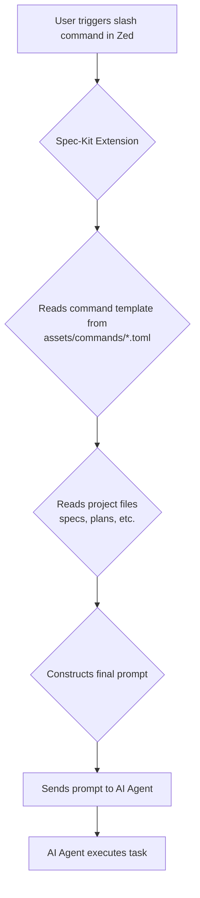

# Spec-Kit for Zed

## Limitations

This is an **MVP (Minimum Viable Product)** extension with severe limitations. It is fundamentally incompatible with Zed's current design for AI chat slash commands.

**TLDR; It doesn't work.**

- **Slash Command Recognition**: Zed's current design for AI chat slash commands is in text-only chats, leading to fundamental incompatibilities with this extension's dynamic command generation. This results in commands not being recognized even when correctly configured.
- **Platform Support**: This extension has only been tested and confirmed to work reliably on **macOS (Bash shell)**.
- **AI Model Compatibility**: This extension has only been tested to work with **Gemini** models available through Zed's Google AI integration. Other AI providers may not be fully supported.

## Overview

Welcome to Spec-Kit for Zed! This extension brings the power and structure of the [Github Spec-Kit](https://github.com/github/spec-kit) development methodology directly into the Zed IDE's native AI chat interface.

It allows you to leverage the familiar `spec-kit` slash commands to guide the AI through a structured workflow, from high-level specification to code implementation, ensuring clarity and consistency throughout the development process.

## What is Spec-Kit?

Spec-Kit is a methodology centered around **Spec-Driven Development**. Traditionally, specifications are often treated as temporary guides that are discarded once coding begins. Spec-Driven Development flips this script by treating specifications as **executable artifacts** that directly generate working implementations.

The core philosophy emphasizes:

- **Intent-Driven Development**: Clearly defining the "_what_" before the "_how_".
- **Rich Specification Creation**: Using established principles and guardrails to create detailed, unambiguous specs.
- **Multi-Step Refinement**: Acknowledging that complex software is built through a series of steps, not one-shot generation.
- **AI-Powered Interpretation**: Relying on advanced AI models to interpret specifications and execute the development process.

By adopting this structured approach, `spec-kit` minimizes ambiguity and ensures the AI assistant has the necessary context to perform tasks effectively, reducing errors and rework.

## Key Features

- **Native Slash Commands**: Use core `spec-kit` commands like `/specify`, `/plan`, and `/implement` directly within Zed's AI chat.
- **Enhanced Context Management**: Introduces a new `/context` command to generate a timestamped summary file of your project's state. This is perfect for grounding new chat threads and ensuring the AI has the most relevant information.
- **Streamlined Workflow**: Enforces a predictable, specification-driven development cycle, reducing ambiguity and improving collaboration with your AI assistant.

## Requirements

1.  **Zed IDE**: This extension is built exclusively for the Zed editor.
2.  **Initialized Spec-Kit Project**: You **must** have `spec-kit` already initialized in your project's root directory. The extension reads from your project's `spec-kit` configuration and templates.
3.  **AI Provider**: This extension currently only works with **Gemini** models available through Zed's AI integration.

## How It Works

The extension operates as an intelligent command processor within Zed's AI chat, creating a seamless three-step workflow:

1.  **The User (You)**: You initiate a stage of development with a slash command, like `/plan "Implement the user authentication spec"`.
2.  **The Zed Extension (The Processor)**: The extension intercepts the command. It reads the necessary `spec-kit` templates and existing project artifacts (like specifications) from your workspace, processes them in memory, and constructs a detailed, context-rich prompt.
3.  **The AI Agent (Gemini)**: The AI receives the comprehensive prompt from the extension and executes the task, such as generating a technical plan or writing code, with a deep understanding of the project's context.



## Available Commands

Here is the full list of available Spec-Kit commands:

- `/constitution`: Establish project principles.
- `/specify`: Create a detailed feature specification from a high-level description.
- `/clarify`: Clarify and de-risk the current specification.
- `/plan`: Create an implementation plan from the current specification.
- `/tasks`: Generate actionable tasks from the current implementation plan.
- `/analyze`: Validate alignment & surface inconsistencies across artifacts.
- `/implement`: Execute a specific task, generating the necessary code and files.
- `/context`: Generates a timestamped `context_summary_YYYYMMSS_HHMMSS.md` file in your project. Use this to ground new AI chat threads with the latest project context.

## Workflow Diagram

The following diagram illustrates the typical Spec-Kit development workflow:

```mermaid
graph TD
    A[Start: Constitution] --> B{Loop for each feature, bug, or iteration};

    B --> C(Specify);
    C --> D(Clarify);
    D --> E(Plan);
    E --> F(Tasks);
    F --> G(Analyze);
    G --> H(Implement);

    H --> B;

    I(Context: Optional, User-Determined)

    I ..> B;
    I ..> C;
    I ..> D;
    I ..> E;
    I ..> F;
    I ..> G;
    I ..> H;
```

## Getting Started

1.  Ensure you have the Zed editor installed and configured with a Gemini model.
2.  Install the "Spec-Kit for Zed" extension from the Zed extension registry.
3.  Open a project that has already been initialized with `spec-kit`.
4.  Open the AI chat panel (`cmd-enter` on macOS).
5.  Begin your development workflow, starting with `/constitution` or `/specify`, or using `/context` to ground a new conversation.

## Development

This extension is built in Rust and compiles to WebAssembly (WASM) to run securely within the Zed editor's extension host. If you are interested in contributing, please start by reading the development guide.

- [**Development Primer**](./reference/Notes/development_primer.md)
